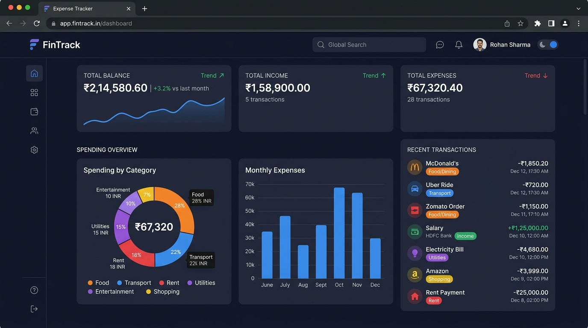

# 💰 Expense Tracker — Full-Stack Personal Finance & Audit Manager

A modern, responsive, and privacy-focused **Expense Tracker** web application with a **built-in SQLite Backend Server** and change-tracking **Audit Logging Engine**. Track income, log expenses in Indian Rupees (₹), visualize spending distributions with interactive charts, record all modifications (additions, soft-deletions, resets), and restore deleted transactions anytime.



---

## ✨ Features

- **💵 Complete Income & Expense Logging:**
  - Track both Income and Expense transactions with description, amount, category, and date.
  - Automatically formats numbers into standard Indian Rupee currency (`₹`).
- **🗄️ Embedded SQLite Database & Backend API:**
  - Persistent storage powered by an embedded SQLite database (`database.db`).
  - Zero-dependency Python backend server (`server.py`) — runs natively on any system without `pip install` or external database configuration.
- **📜 Change History & Audit Logs (`audit_logs` Table):**
  - Records every transaction created, deleted, reset, or restored with precise timestamps and details.
  - **Soft-Delete System:** When you delete a transaction, it is archived into the audit history rather than permanently destroyed.
  - **One-Click Restore:** Browse deleted transactions in the "Audit History" modal and restore them back to the active list instantly!
- **📊 Real-time Financial Overview:**
  - Instant balance calculation (`Total Balance = Total Income - Total Expenses`).
  - Total Income and Total Expenses breakdown cards.
  - Savings Rate percentage and monthly expenditure indicators.
- **📈 Interactive Data Visualizations (Chart.js):**
  - **Spending by Category:** Interactive Doughnut chart showing percentage and amount per expense category with hover tooltips.
  - **Monthly Expense Trends:** Chronological bar chart showing monthly spending history.
- **🔍 Search, Filter & Sort:**
  - Live instant search across transaction descriptions and categories.
  - Quick filter buttons for **All**, **Income**, and **Expense**.
  - Dropdown filter by specific category.
  - Flexible sorting: Newest First, Oldest First, Highest Amount, and Lowest Amount.
- **🔄 Dual Storage Engine (Hybrid Fallback):**
  - Automatically connects to the SQLite backend API when `server.py` is running (`🟢 SQLite Database Active`).
  - Gracefully falls back to browser `LocalStorage` if opened directly as a static file (`💾 LocalStorage Mode`).
- **🌓 Light & Dark Theme:**
  - Smooth theme switching with automatic system preference detection and LocalStorage persistence.
  - Theme-aware Chart.js components.
- **📥 CSV Data Export:**
  - One-click export of all transactions into a standard `.csv` spreadsheet file.
- **📱 Fully Responsive & Accessible:**
  - Fluid mobile, tablet, and desktop layouts built with CSS Grid, Flexbox, and keyboard accessibility.

---

## 🛠️ Technologies Used

| Layer | Technology | Purpose |
| :--- | :--- | :--- |
| **Backend** | **Python Standard Library** (`http.server`, `sqlite3`, `json`) | Zero-dependency REST API server & database engine |
| **Database** | **SQLite3** (`database.db`) | ACID-compliant local database storing `transactions` & `audit_logs` |
| **Frontend Core** | **HTML5 & Vanilla JavaScript (ES6+)** | Semantic structure, dynamic UI updates, dual-mode data layer |
| **Styling** | **CSS3 (Custom Properties & Grid)** | Modern light/dark design system, responsive breakpoints, animations |
| **Charts** | **[Chart.js](https://www.chartjs.org/) (CDN)** | Canvas-based doughnut & bar analytics |
| **Icons & Fonts** | **[Font Awesome](https://fontawesome.com/) & [Google Fonts](https://fonts.google.com/)** | UI icons, Inter & Plus Jakarta Sans typography |

---

## 🚀 How to Run the Application

### Option 1: Full-Stack Mode with Backend & SQLite Database (Recommended)

1. Open PowerShell or Command Prompt in the project folder:
   ```powershell
   cd "C:\Users\R Hareeswar\.gemini\antigravity\scratch\expense-tracker"
   ```
2. Start the backend server:
   ```powershell
   python server.py
   ```
3. Open your browser at:
   ```text
   http://localhost:5000
   ```
   *(You will see the green "🟢 SQLite Database Active" badge in the top header).*

---

### Option 2: Standalone Static Mode (No Server / LocalStorage Only)

1. Double-click **`index.html`** or open it in any web browser.
2. The app will run in offline mode using your browser's LocalStorage.

---

## 🌐 REST API Endpoints

When running `python server.py`, the following REST API endpoints are available:

| Method | Endpoint | Description |
| :--- | :--- | :--- |
| `GET` | `/api/transactions` | Retrieve all active transactions |
| `POST` | `/api/transactions` | Add a new transaction & write `CREATE` audit log |
| `DELETE` | `/api/transactions/<id>` | Soft-delete a transaction & write `DELETE` audit log |
| `POST` | `/api/transactions/restore/<id>` | Restore a deleted transaction back to active list |
| `GET` | `/api/audit-logs` | Retrieve full history of all additions and deletions |
| `GET` | `/api/deleted-transactions` | Retrieve only deleted transactions (Trash) |
| `POST` | `/api/reset` | Archive all active transactions & record `RESET` log |
| `POST` | `/api/sample-data` | Seed demo transactions into database |
| `GET` | `/api/health` | Health check endpoint |

---

## 📂 Project Structure

```text
expense-tracker/
├── server.py           # Python HTTP server & SQLite REST API handler
├── database.db         # Auto-generated SQLite database (transactions & audit_logs)
├── index.html          # Main application UI, stats cards & modal dialogs
├── style.css           # Modern design system, responsive styles & theme tokens
├── script.js           # Client-side state manager, API connector & Chart.js logic
├── LICENSE             # MIT License
├── README.md           # Documentation & instructions
└── assets/
    └── screenshot.png  # Application screenshot preview
```

---

## 🔮 Future Improvements

- [ ] Multi-user authentication & login sessions.
- [ ] Custom category manager with user-defined icons and colors.
- [ ] Monthly budget limit goals with threshold alerts.
- [ ] Export Audit Trail to PDF / CSV.

---

## 📄 License

This project is licensed under the **MIT License** — see the [LICENSE](LICENSE) file for details.
